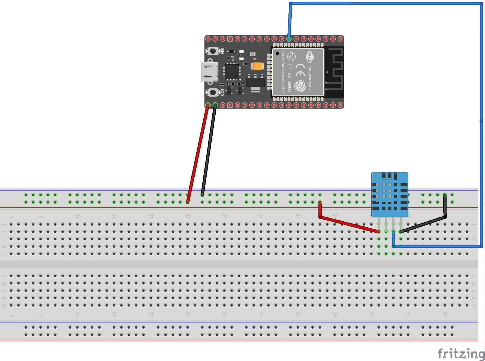
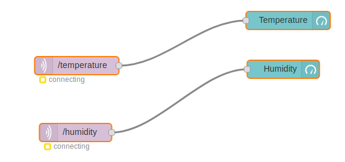

# capteur-de-temperature
 
 Ce projet permet de réaliser un capteur de température et d'humidité avec une interface(NODE-RED)
 Il a été réalisé par [@OSylla92](https://github.com/OSylla92) et [@luisribeiro1995](https://github.com/LuisRibeiro1995)
 
 ## Vidéo 
 
 
 
 ## Matériels utilisés
 + Breadbord
 + DHT11 Temperature and Humidity
 + Jumper wire
 + USB Cable 
 + ESP32
 
## Bibliothèques utilisés

 + DHT-sensor-library
 + Wifi
 + Adafruit MQTT
 + Adafruit Unified Sensor
 + Timerlibfritz_temp.jpg

## **Montage**

## Node-red

